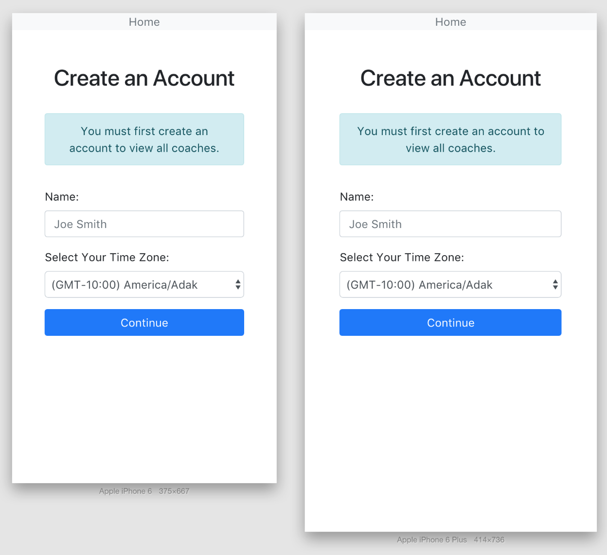
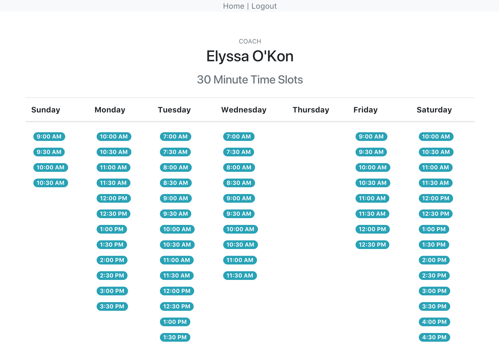

##### by Chris Dritsas
# Appointment Scheduler

### Setup

* `bundle install`
* `bundle exec rails db:setup`
* `bundle exec rails import:all_data:from_csv`

### Run RSpec's

* `bundle exec rspec`

### Run App

* `bundle exec rails s`
* `http://localhost:3000/`

### Screenshots

* Mobile Ready!

---

* Readability!

---

### Some (Not All) Todo's

* `bundle exec rubocop -a`
    
    This produced a bunch of issues that I'd need to
    fix but don't have the time for during this exercise :-(

* `bundle exec rspec`

    Still have many pending, also need to enhance
    how I'm using it by bolting on things like
    Factory Girl (Factory Bot), etc...

* The UI/UX is a bit bland, need to add some #zest to it!
Would like the project to feel more alive as you click
through the interface.    

